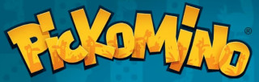
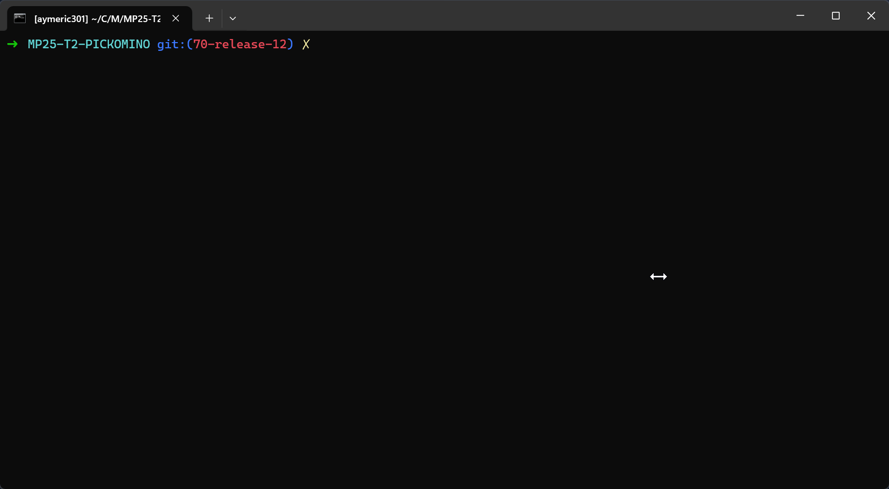

[](https://github.com/bts-lasalle-avignon-projets/MP25-T2-PICKOMINO/actions/workflows/makefile.yml)
[](https://github.com/bts-lasalle-avignon-projets/MP25-T2-PICKOMINO/actions/workflows/format.yml)
[](https://github.com/bts-lasalle-avignon-projets/MP25-T2-PICKOMINO/actions/workflows/check.yml)

# Mini-projet : Pickomino

- [Mini-projet : Pickomino](#mini-projet--pickomino)
  - [Informations](#informations)
  - [Le jeu du Pickomino](#le-jeu-du-pickomino)
  - [Utilisation](#utilisation)
  - [Itérations](#itérations)
    - [Itération 1](#itération-1)
    - [Itération 2](#itération-2)
    - [Itération 3](#itération-3)
  - [Changelog](#changelog)
    - [Version 1.0](#version-10)
  - [TODO](#todo)
  - [Défauts constatés non corrigés](#défauts-constatés-non-corrigés)
  - [Équipe de développement](#équipe-de-développement)

---

## Informations

- Nom du mini-projet : Pickomino
- Date de début : 30 Septembre 2024
- Numéro de version du jeu : 1.0

## Le jeu du Pickomino



**Objectif : Remporter le plus de vers possible.**

- Nombre de joueurs : de 2 à 7
- Temps de jeu : environ 20 à 30 minutes
- 8 dés à 6 faces
- 16 Pickominos (valeurs de 21 à 36) formant une brochette

Lancez les 8 dés, choisissez une valeur de dés à mettre de côté, puis décidez de relancer ou pas.

Vous pouvez relancer les dés restants autant de fois que vous le souhaitez, à condition de toujours pouvoir retenir une valeur de dés différente.

Si vous êtes dans l'incapacité de le faire alors vous devrez rendre un de vos précieux Pickomino et passer votre tour !

Lorsque votre tour est fini, faites l’addition pour savoir quel Pickomino prendre au centre de la table (la brochette) ou même dans la main de vos adversaires !

La partie prend fin lorsqu'il ne reste plus aucun Pickomino visible sur la brochette.

Chaque joueur va alors compter le nombre de vers qu'il possède.

Le joueur ayant le plus de vers à remporté la partie.

En cas d'égalité, le joueur ayant le Pickomino le plus élevé gagne.

[Un résumé des règles basiques est disponible ici](./images/regles.jpg)

## Utilisation

```bash
$  make

$  ./pickomino.out
```



## Itérations

### Itération 1

- **Démarrer une partie** : Le joueur peut entrer les paramètres de la partie (nombre de joueurs, ...) et la lancer.
- **Jouer des parties** : Possibilité pour le joueur de jouer une ou plusieurs parties.

### Itération 2

- **Saisir informations joueurs** : Possibilité pour les joueurs de saisir leurs noms.
- **Jouer contre la machine** : Possibilité pour les joueurs de jouer contre une/plusieurs machines.

### Itération 3

- **Jouer en réseau** : Jouer une partie en réseau.
- **Voir l'historique** : Visualiser un historique des parties jouées.
- **Voir le classement** : Visualiser un classement des joueurs.

## Changelog

Le programme permet de jouer une partie de Pickomino de 2 à 7 joueurs.

### Version 1.0

- [x] Saisie du nom des joueurs
- [x] Jouer une partie

## TODO

## Défauts constatés non corrigés

## Équipe de développement

- ÉTUDIANT 1 : [Aymeric CLEMENT](aymeric.clement.pro@gmail.com)
- ÉTUDIANT 2 : [Louis RAFFIN](louis.raffin.pro@gmail.com)

---

&copy; 2024-2025 LaSalle Avignon
